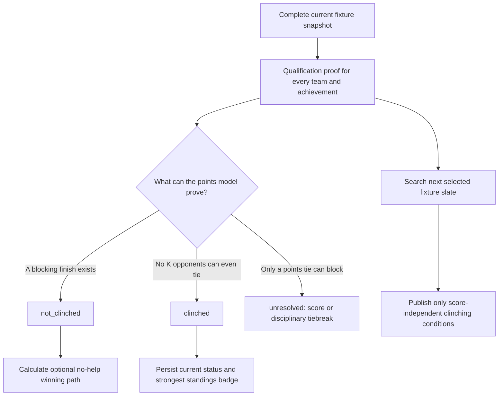
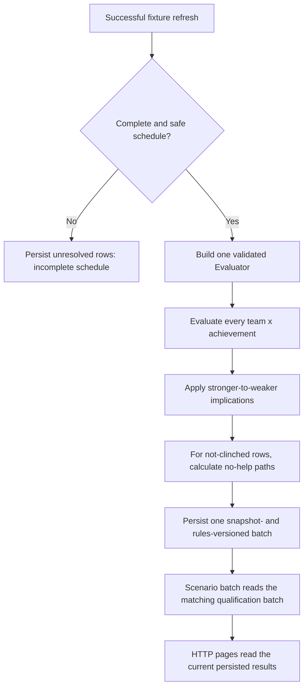
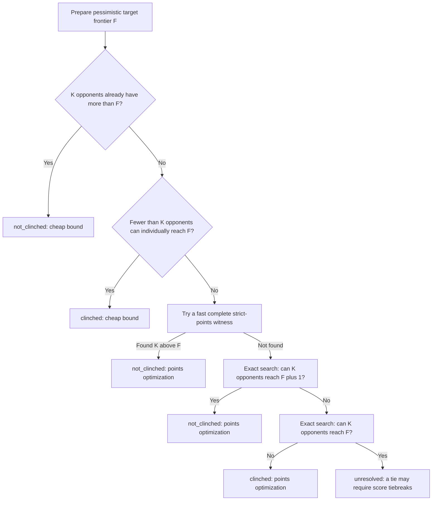
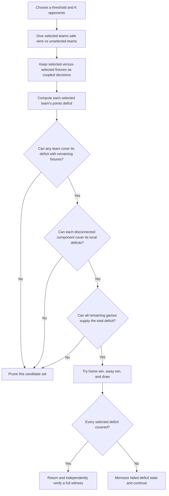
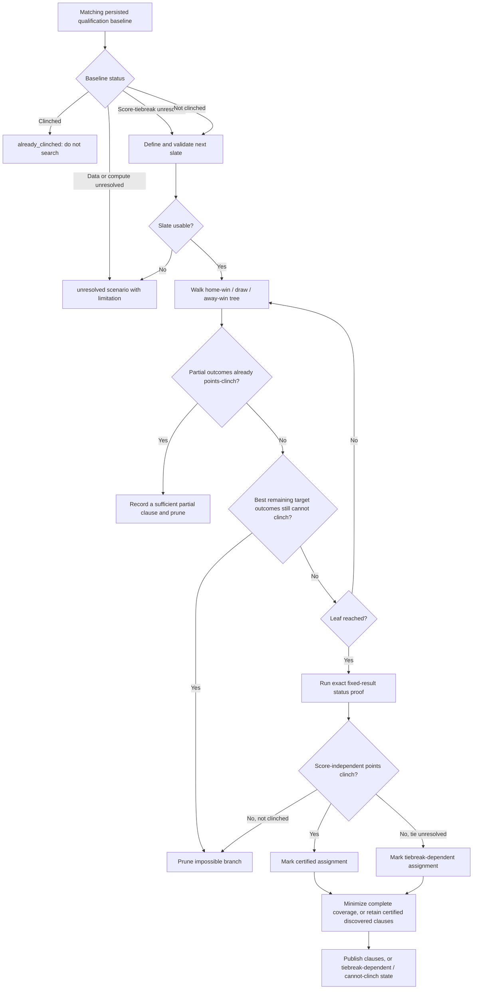

# How clinching works

This is the guide to the **current** qualification and clinching-scenario
implementation. It is deliberately layered: start with the short version, then
follow the proof flow or the implementation details as needed. The original
phase documents remain useful design history: [season-scale status](phases/12-season-scale-clinching.md)
and [clinching scenarios](phases/13-clinching-scenarios.md).

## The short version

For any achievement with a top-`K` cutoff, a team has **clinched** only when
there is no feasible way for `K` other teams to finish ahead of it. The system
is deliberately conservative:

- `clinched` means the guarantee has been proved.
- `not_clinched` means the solver found a feasible completion that can keep
  the team below the cutoff. It does **not** mean the team has been eliminated.
- `unresolved` means the system cannot honestly settle the answer from the
  available data, an outcome-only points proof, and its computation budget.

The clinching-scenarios page separately publishes a playoff-elimination path
when it has a stronger proof: eight opponents already have strictly more
points than the target can reach even by winning every remaining match. This
is not inferred from `not_clinched`, standings position, or a tiebreak.

The current 2026 regular-season rules are configuration, not solver constants:
16 teams, 30 matches per team, with Shield (top 1), top-four seed (top 4), and
playoffs (top 8). A stronger guarantee implies each weaker one: Shield →
top-four seed → playoffs. A top-four seed normally hosts the opening playoff
match, but venue availability means hosting itself is not an unconditional
qualification guarantee.

The key idea is that the solver gives the target its **worst** remaining results
(losses) before evaluating its rivals. If the target is still guaranteed a
top-`K` finish from that pessimistic frontier, it is clinched.

## What must be true before a proof runs

Qualification is a derived batch, calculated after a durable fixture refresh;
ordinary page requests only read the persisted batch. Before any team is
evaluated, the refresher verifies:

- the fixture inventory has the expected teams and matches, and every
  participant has the configured number of matches;
- every fixture is either completed with both scores or `PreMatch` with neither
  score;
- every pending fixture has a valid kickoff time, so it can be put in a stable
  chronological order; and
- the configured season rules are valid.

If any check fails, every status is `unresolved` with
`incomplete_schedule`; the site does not quietly substitute a partial-table
answer. A shared qualification budget (five seconds by default) likewise
produces an explicit `compute_budget` result rather than a guess.

The result is tied to both the immutable fixture snapshot and the season-rule
version. This prevents a badge or scenario from being mixed with results
calculated from a different schedule or playoff format. The standings table
shows a green badge for proved clinches and a red × marker (with a standings
key) only for a separately proved, points-only playoff elimination;
`not_clinched` alone never produces an elimination indicator.

## Status proof: the mental model

Let `F` be the target team's final points after:

1. applying completed scores and any caller-supplied fixed outcomes; and
2. making the target lose every remaining fixture that has not been fixed.

All remaining fixtures not involving the target are then the solver's
decisions. This is valid because any better target outcome can only make a
clinching proof easier. The solver asks two related questions about the target's
pessimistic frontier `F`:

- Can at least `K` opponents finish with **more than `F`** points?
- If not, can at least `K` opponents finish with **at least `F`** points?

### Why two thresholds matter

The strict query, `F + 1`, identifies a points-only way to deny the target.
One feasible assignment is enough to prove `not_clinched`.

If no `K` opponents can finish strictly above `F`, the target cannot be
denied on points alone. The level query, `F`, distinguishes the remaining
cases:

| Result of the level query | Meaning |
| --- | --- |
| Fewer than `K` opponents can reach `F` | Even a tiebreak cannot put `K` teams ahead; the team is `clinched`. |
| `K` opponents can reach `F` | A score-based or unavailable tiebreak might matter, so the status is `unresolved`, not a premature clinch. |

This is why a team may look safe in the table but not receive a clinched badge:
the system refuses to turn an unproved goal-difference, head-to-head, or
disciplinary tiebreak outcome into a mathematical claim.

## How the coupled-fixture solver proves the points questions

Individual maximum points are a useful screen, but they are not a proof: two
rivals playing each other cannot both receive three points from that game. The
exact solver preserves that coupling.

For each threshold and candidate set of `K` opponents, it awards selected
opponents a win against unselected opponents, gives unrelated fixtures a draw,
and leaves only selected-versus-selected fixtures as decisions. It then searches
the remaining fixture graph for enough points to cover each selected team's
deficit to the threshold.

The solver uses branch-and-bound with memoized deficit states. It prunes when a
team, a disconnected component, or the remaining games collectively cannot
supply enough points. A returned blocking witness assigns every remaining game;
canonical scorelines (`1-0`, `0-0`, `0-1`) make the witness readable
without pretending those scores affected a strict-points proof.

## Tiebreaks and the completed-season exception

While fixtures remain, the live proof uses points only. A level-points blocking
completion is reported as `unproved_score_tiebreak`; it is not simulated using
an arbitrary score cap.

When there are no pending fixtures, the system calculates the official
total-points table from actual scores. Its available ordering is points, goal
difference, wins, goals scored, head-to-head points, and head-to-head goals
scored. If a final tie still reaches least disciplinary points, which is not in
the cache, the system compares the tied group's best and worst possible ranks
with each achievement cutoff. A tie wholly above or below the cutoff is
decisive; only a tie that crosses the cutoff is `unresolved` with
`missing_disciplinary_rule`. The deterministic display order used as a final
fallback is never used as an official clinching proof.

## Reading a stored qualification result

Every result carries the team, achievement, top-`K` value, status, method,
reason, point-count evidence, optional witnesses, no-help path, and diagnostics.

| Method | Interpretation |
| --- | --- |
| `cheap_bound` | A linear points bound decided the answer without exact search. |
| `points_optimization` | The coupled-fixture solver found a strict blocker or proved neither strict nor level blockers can reach the cutoff. |
| `accessible_tiebreak` | A completed season was settled from actual scores using the available official table rules. |
| `unproved_score_tiebreak` | A level-points completion exists, but future score tiebreaks were not proved. |
| `missing_disciplinary_rule` | A completed-table tie needs disciplinary points that are unavailable. |
| `compute_budget` | The shared calculation deadline expired. |
| `incomplete_schedule` | The fixture snapshot was incomplete, unsafe, or could not be ordered. |
| `implied_achievement` | A stronger clinch implies this weaker achievement. |

`StrictlyAhead` and `AtLeastLevel` record either exact counts or safe
lower/upper bounds, depending on the proof path. `BlockingWitness` shows a
schedule that denies the target; `FrontierWitness` shows the level-points
completion that made the tiebreak question unresolved.

## “No help” paths

For a `not_clinched` result, the batch also asks: *Can this team guarantee the
achievement by winning its own next matches, regardless of every other result?*

The evaluator fixes all of the target's remaining matches as wins, in kickoff
order. If that is enough, it binary-searches the earliest successful prefix and
stores those fixture IDs. It does **not** claim that any arbitrary number of
wins is enough: the named matches, including their opponents, are part of the
proof.

| No-help state | Meaning |
| --- | --- |
| `guaranteed` | Winning the listed chronological prefix clinches the achievement without outside help. |
| `impossible` | Even winning every remaining target match cannot guarantee it. |
| `unresolved` | The endpoint depended on an unresolved proof or the budget expired. |
| `not_applicable` | The team had already clinched. |

## Next-slate clinching scenarios

The scenario feature answers a different question: *Which upcoming results are
sufficient for a clinch by this slate's cutoff?* It never replaces the normal
season-long status proof.

The slate is explicit. The system uses the next matchday when its data is
reliable; otherwise it includes pending fixtures in the 120-hour window starting
with the next kickoff. Every usable slate is searched. The proof-directed walk
prunes branches as soon as it can certify a sufficient clinch or rule out a
possible one, and uses the independently configured scenario budget as its only
operational limit. When the budget expires, any clauses already found remain
published because they are certified; the result also says that additional paths
may exist.

Only `cheap_bound` and `points_optimization` clinches are publishable
outcome-only scenario clauses. A clause is tested against **every** slate
assignment it represents, then generalized where all of its outcomes are
certified. That permits honest phrases such as “does not win” while withholding
conditions that depend on goal margin or unavailable disciplinary data.

| Scenario state | Meaning |
| --- | --- |
| `already_clinched` | The baseline already proved the achievement. |
| `can_clinch` | At least one score-independent, sufficient outcome clause was certified. |
| `cannot_clinch` | All complete slate outcomes were definitively non-clinching. |
| `tiebreak_dependent` | A possible clinch may depend on scores or unavailable tiebreak data; no outcome-only clause is published. |
| `unresolved` | The baseline, slate data, or compute budget prevented a conclusive search. |

When a `can_clinch` result has tiebreak-dependent leaves or ends at its compute
budget, the visible clauses remain valid but may not cover every theoretical
path. The UI says so instead of implying that the displayed conditions are
necessary.

### Scenario presentation

The page groups confirmed scenarios by the team's own results, in kickoff
order and from wins through draws to losses. Overlapping conditions such as
“win” and “win or draw” are split so the draw group includes exactly the
outside help certified for a draw. All own-result group headings and factored
requirements stay visible, with exact paths in expandable sections. Results
from one match with identical outside help share a heading, such as “draws or
loses.” Two-match result orderings share a heading only when their outside help
is identical; for example, “wins one match and loses the other” still names
the two specific fixtures.
For unusual slates with more than four relevant own fixtures, the page retains
the original, potentially overlapping own-result groups to bound expansion.

Within a group, a visible factored summary puts common requirements once above
an “any of” list. The summary may contain overlapping alternatives when that
is shorter and clearer. A group with more than twelve summary paths instead
directs readers to its exact paths, avoiding a large nested list.
When different results of one outside match appear in several paths, the
summary groups a repeated result before other shared conditions. If an earlier
path already covers one result of a broader condition, the summary removes
that redundant result. For Bay FC's draw scenarios, KC wins sit together;
the SEA-win alternatives then name a DEN win where applicable. Each rewrite
must preserve the certified outcome union. Alternatives with the same number
of conditions are ordered by their displayed result text, keeping repeated
results such as DEN wins adjacent regardless of fixture IDs.

Groups with multiple paths also offer expandable, complete certified paths.
Each exact path puts its requirements on one compact line, separated by `+`,
with a club crest and two- or three-letter team code; each path is an `OR`
alternative to the others. When alternatives for two fixtures of the same team
exactly equal a minimum points total, the page names both matches and that
total. This rewrite checks all nine outcome combinations and never infers an
uncertified combination from a points total. Both the summary and exact paths
preserve the union of stored certified clauses, including partial results.
Repeated equivalent clauses and stronger clauses already covered by a weaker
one need not be displayed repeatedly.

The exact-path view subtracts partial overlap between outside-help paths before
combining results into points totals. Paths with fewer fixture requirements
take precedence, with a stable fixture-ID and outcome-mask ordering to break
ties. Each later path keeps only outcomes not already represented. For example,
if “SEA wins or draws at LA + UTA draws vs LA” is already shown, the additional
path “SEA wins or draws at LA + UTA wins or draws vs LA + SEA wins or draws at
DEN” narrows to require a UTA **win**. When two equal-length paths both include
the same pair of draws, that pair remains in only one alternative. Subtraction
can split a path into several alternatives; it never drops a unique outcome
or adds an uncertified one. Points compaction preserves this disjoint union.

The pairwise coverage pass is capped at 256 clauses per group. Overlap
subtraction is capped at 256 paths, including intermediate expansion, and
65,536 subtraction operations. Larger inputs or an expansion/work overflow
retain the original certified alternatives, which can still overlap. These
limits keep presentation work bounded on ordinary cache-only page requests.

Every complete certified path remains available in its group's disclosure.
The visible summary has at most one shared-condition factoring level; the
exact-path view stays flat.
Unlisted matches are unrestricted. The full included schedule remains collapsed
below the results, with its date range above them. Incomplete-result notices
remain visible for both clinching and elimination paths. Ordinary page requests
read only cached results and do not rerun qualification or scenario discovery.
No-help winning paths are labeled season-long because they can include matches
after the displayed slate.

Use `make test-clinching` for focused scenario-proof and presentation checks.
These checks also run within `make test` and CI, including exhaustive
outcome-equivalence, disjoint detailed alternatives, future-fixture elimination,
and summary equivalence; visually verify desktop and 390px layouts, expansion,
keyboard access, and team filtering when changing the presentation.

## Playoff-elimination scenarios

Alongside positive clinching opportunities, the page can show that a team
**can be eliminated from the playoffs** during the same slate. The search uses
the target's best possible points ceiling: every still-unfixed target match is
treated as a win. It first counts opponents already strictly above that
ceiling. When that alone does not prove elimination, it asks whether any legal
completion of the other remaining fixtures can keep at least eight opponents
at or below the ceiling. If no such completion exists, future head-to-head
fixtures force an eighth opponent above it and the slate condition is certified.

For a fixed candidate set of opponents to keep below the ceiling, a match
against anyone outside the set can award the outsider the win. Only matches
between two selected opponents constrain their points capacities. The exact
search checks every legal result of those matches, with the scenario budget as
its compute limit. A found feasible completion is a reason to withhold the
elimination claim; an exhausted search never becomes a proof.

The initial, already-above-ceiling check is completed before any budget-limited
scenario search, so a team eliminated by that cheap bound remains identified
even if earlier team searches consume the shared scenario budget. A
future-fixture proof uses the available compute budget and can be retried.

This makes the claim independent of every score tiebreak. The feature still
withholds close cases in which a team could be eliminated only through goal
difference or unavailable tiebreak data. A team satisfying either points-only
proof before the slate is displayed as already eliminated. Changing the proof
semantics increments the scenario definition version so the persisted batch is
recalculated.

## Where to look in the code

- [`internal/clinching/evaluate.go`](../internal/clinching/evaluate.go)
  contains the status decision flow.
- [`internal/clinching/cutoff.go`](../internal/clinching/cutoff.go)
  implements the exact coupled-fixture cutoff solver.
- [`internal/clinching/evaluator.go`](../internal/clinching/evaluator.go)
  reuses a validated snapshot, accepts fixed results, and derives no-help paths.
- [`internal/qualification/refresher.go`](../internal/qualification/refresher.go)
  validates, batches, implies weaker achievements, and persists status.
- [`internal/scenarios/search.go`](../internal/scenarios/search.go) traverses
  the next slate; [`coverage_minimize.go`](../internal/scenarios/coverage_minimize.go)
  turns certified assignments into human-sized clauses.
- [`internal/scenariorefresh/refresher.go`](../internal/scenariorefresh/refresher.go)
  stores scenarios only against the matching qualification snapshot.

For behavior-level examples and guardrails, see the tests in
[`internal/clinching`](../internal/clinching) and
[`internal/scenarios`](../internal/scenarios).
