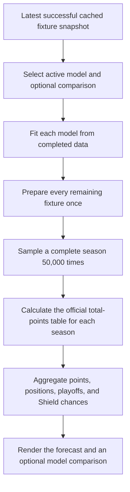
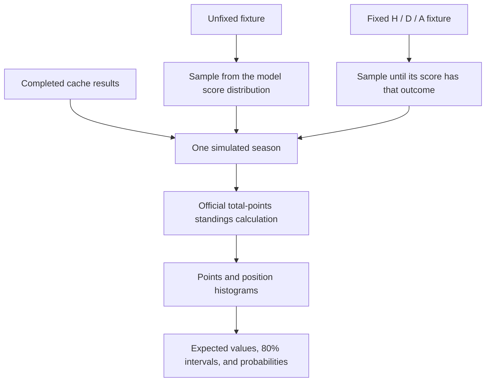

# How Forecast Lab works

This guide describes the current **Forecast Lab** implementation at
`/seasons/{season}/forecast`. It follows a forecast from the cached fixture
snapshot through a complete simulated season, explains what a fixed result
does, and draws a clear line between an outlook and a mathematical clinching
proof. The phase documents retain the design history:
[forecast-first simulator](phases/10-forecast-simulator.md) and
[xG and model comparison](phases/11-xg-and-models.md).

## The short version

Forecast Lab completes the season 50,000 times using one selected, versioned
score model. In every simulated season it preserves played results, samples a
score for every remaining cached fixture, calculates the regular-season table,
and aggregates the results.

- Official standings contain only real completed results. A forecast is a
  model-based outlook, not an updated table.
- A fixed result is a visitor assumption that a particular home win, draw, or
  away win occurs. It is not a model prediction and it does not fix an exact
  scoreline.
- Every model runs against the same fixture snapshot, fixed outcomes, playoff
  cutoff, and number of simulations. A comparison shows how model assumptions
  change the outlook.
- The page is reproducible for unchanged input: its random seed is derived
  from the selected model, cached fixture data, and fixed assumptions.



The default model is currently **xG Poisson** (`xg-poisson-v1`). It is the
recommendation selected by the checked-in historical walk-forward evaluation;
see [Model evaluation v1](model-evaluation-v1.md) for its development,
final-test, and pooled results.

## What Forecast Lab needs before it can run

Forecast Lab is a request-time calculation over the latest successful cache;
an ordinary page request does not call ASA or write a forecast back to SQLite.
It requires at least one cached fixture and validates the data it uses:

- teams and fixture IDs must be unique, and each fixture must reference known
  teams;
- completed (`FullTime`) fixtures must have non-negative scores;
- remaining (`PreMatch`) fixtures must not already have scores; and
- each fixed assumption must name a still-remaining cached fixture and use a
  valid home-win, draw, or away-win outcome.

Fixtures with other statuses are not invented into a season result. If the
cached fixture inventory does not match the configured regular-season size, the
forecast can still run, but the page warns that it includes only the fixtures
currently in the cache.

The xG model reads only validated, available ASA **team-model** xG for
completed games. The page reports its coverage; a warning appears below 95%.
Missing xG is deliberately not substituted with actual goals.

## The model catalog

Every model has a stable ID. Changing its formula or constants requires a new
ID, so a shared URL always says which model produced its outlook.

| Model | ID | Completed-data input | Main assumption |
| --- | --- | --- | --- |
| Current pace | `current-pace-v1` | Scores and table points | A team's observed points pace directly scales its future scoring rate. It does not model opponent defence. |
| Results Poisson | `results-poisson-v1` | Scores | Team attack and goals-conceded rates, with league and team shrinkage, explain future scoring. |
| xG Poisson | `xg-poisson-v1` | Available ASA team-model xG | The Results Poisson formula applies to available xG rather than goals; missing xG stays missing. |

All three models turn a fixture into independent home and away Poisson score
distributions. Their scoring rates are bounded between `0.20` and `4.50` goals
per side, which keeps sparse early-season data from producing implausibly
extreme scorelines.

### Results Poisson and xG Poisson

The two Poisson models share the same structure. For Results Poisson, let `M`
be completed matches, `HG` and `AG` their home and away goals, and use the
fixed league priors of 20 matches at 1.50 home goals and 1.20 away goals:

```text
league_home = (HG + 20 * 1.50) / (M + 20)
league_away = (AG + 20 * 1.20) / (M + 20)
league_rate = (league_home + league_away) / 2
```

For a team with `P` completed matches, `GF` goals for, and `GA` goals against,
the eight-team-match shrinkage produces:

```text
attack  = ((GF + 8 * league_rate) / (P + 8)) / league_rate
defence = ((GA + 8 * league_rate) / (P + 8)) / league_rate
```

`defence` is a goals-conceded multiplier, so a value above one raises an
opponent's expected scoring rate. For home team `H` and away team `A`:

```text
lambda_home = clamp(league_home * attack_H * defence_A, 0.20, 4.50)
lambda_away = clamp(league_away * attack_A * defence_H, 0.20, 4.50)
```

The simulator independently samples `Poisson(lambda_home)` and
`Poisson(lambda_away)`.

`xg-poisson-v1` uses this exact calculation with available team-model xG in
place of `HG`, `AG`, `GF`, and `GA`. Only completed fixtures with available xG
contribute to its fit. This means incomplete xG coverage can make its outlook
different from Results Poisson for two reasons: the input values differ, and
the model may have fewer observed matches. It does not fall back to results.

### Current pace

Current pace uses the same home-goal, away-goal, and 20-match priors to
establish baseline scoring rates. It then turns points per game into each
team's multiplier. With `TP` total points awarded in `M` completed matches:

```text
league_ppg = (TP + 40 * 1.35) / (2 * M + 40)
team_ppg   = (team_points + 8 * league_ppg) / (team_matches + 8)

lambda_home = clamp(league_home * home_ppg / league_ppg, 0.20, 4.50)
lambda_away = clamp(league_away * away_ppg / league_ppg, 0.20, 4.50)
```

It is intentionally simple: a team's own observed points pace affects its
rate, while the opponent's defensive record does not. The priors make all
three models usable before teams have completed a match.

## One simulated season

The simulator fits the selected model once, sorts fixtures by ID, and prepares
one score distribution for every remaining fixture. Each iteration then:

1. retains all completed cached results;
2. samples one scoreline for every remaining fixture, honoring any fixed
   outcome;
3. calculates a full table using the 2026 official total-points ordering; and
4. adds each team's points and finishing position to its aggregate.

The official ordering uses points, goal difference, wins, goals scored,
head-to-head points, and head-to-head goals scored. If those accessible rules
cannot separate a tied group because the cache lacks disciplinary points, the
simulator gives each tied team an equal share of every position occupied by the
group. It therefore does not let a deterministic display fallback create a
spurious probability advantage.

The production default is 50,000 simulated seasons. The simulator checks the
HTTP request context at least every 100 iterations, so cancelled requests stop
instead of continuing to consume CPU. If there are no remaining fixtures, it
calculates the known final table once and gives that table the full simulation
weight.



## Fixed outcomes are conditional scorelines

The assumption builder accepts only an outcome: home win (`h`), draw (`d`), or
away win (`a`). It does not replace a fixture with an arbitrary canonical
score such as `1–0` or `0–0`.

Instead, the simulator samples from the selected fixture distribution until it
gets a scoreline with the required relationship. This is rejection sampling
from the model's conditional score distribution. It tries at most 10,000 times
as a defensive guard; the clamped positive scoring rates make hitting that
limit unexpected.

That distinction matters for goal-based and head-to-head tiebreakers. Even if
every remaining match is fixed as a win, draw, or loss, final positions can
remain uncertain because the model still samples plausible winning margins and
draw scores. Switching models preserves the fixed outcomes but can change those
conditional scoreline distributions.

## Reading the projected-finish table

Each row combines 50,000 internally consistent seasons; it is not a sequence
of independent per-fixture percentages.

| Value | Meaning |
| --- | --- |
| Expected points | Mean final points across simulated seasons. |
| 80% points interval | The 10th through 90th percentile final-points range. |
| Top 4 | Share of the position distribution that finishes first through fourth. |
| Playoffs | Share of the position distribution inside the configured playoff field. |
| Shield | First-place share of the position distribution. |
| Finish distribution | The 10th through 90th percentile finishing-position range and probability for every finishing place with non-zero probability. |

The table is sorted by top-4 chance, then expected points, then a stable team
name/ID order. The full finish distribution is available from each team row,
so the range of plausible finishes remains visible without presenting an
average finishing position as a literal outcome.

### Comparing models

An optional comparison runs the second selected model with the same teams,
fixtures, fixed outcomes, iteration count, and playoff rules. The table keeps
the active model as the main row and shows the comparison metrics plus
`comparison − active` deltas:

- expected-point deltas are shown to one decimal; and
- top-4, playoff, and Shield deltas are percentage points.

The models do not share forced random score samples. Each model has its own
deterministic seed because their score distributions are different. The
comparison is therefore about differing model assumptions, not a claim that
one model has proved the other wrong.

## Reproducible, shareable scenarios

Forecast Lab has two URL formats. The current canonical form is:

```text
?v=2&m={active-model-id}&c={comparison-model-id}&p={game-id}:{h|d|a}&p=...
```

- `v=2` identifies the encoding.
- `m` is required and selects the active model.
- `c` is optional, must be a different supported model, and selects a
  comparison.
- Each `p` fixes one remaining fixture. Generated links sort these values by
  game ID.
- At most 12 fixed outcomes are accepted. Malformed, duplicate, unknown,
  completed, or otherwise stale fixture assumptions return `400 Bad Request`.

The app continues to accept legacy version-1 Results Poisson links, but it
generates version-2 links. A bare `/forecast` chooses the catalog default;
generated share links always name their selected model so a future default
change cannot alter that scenario's model choice. The team selector is only a
presentation filter and is intentionally omitted from share, reset, model, and
assumption-removal links.

The random seed is the first eight bytes of a SHA-256 hash over the model ID,
sorted team IDs, sorted cached fixture IDs/statuses/scores, sorted fixed
outcomes, and model-specific fitted input. Only xG Poisson adds xG values to
that last component. Display names, refresh times, raw payloads, and unused xG
rows do not affect the seed.

A URL preserves model choices and assumptions, **not** a historical source
snapshot. It always uses the latest successful cache. When a fixture later
completes or disappears, an assumption that names it becomes stale and the
link is rejected rather than silently reinterpreted.

## Forecasts are not clinching proofs

Forecast Lab asks, *what does this model expect over many plausible complete
seasons?* The clinching system asks, *is there any feasible completion that can
deny a stated achievement?* They answer different questions:

| Forecast Lab | Clinching system |
| --- | --- |
| Samples a finite number of model-weighted seasons. | Searches feasible outcomes for a guarantee or a blocking completion. |
| Reports probabilities, averages, and uncertainty intervals. | Reports `clinched`, `not_clinched`, or explicitly `unresolved` proof status. |
| Depends on model inputs and assumptions. | Uses conservative outcome constraints and does not treat a forecast probability as proof. |
| Can show a 99.9% playoff chance without a guarantee. | Can prove a playoff place even if Forecast Lab assigns it a lower chance. |

Use the [clinching guide](clinching-logic-guide.md) for the qualification
proof, its tiebreak boundary, and next-slate clinching conditions. Forecast
probabilities never replace those badges or conditions.

## Where to look in the code

- [`internal/forecast/catalog.go`](../internal/forecast/catalog.go) defines the
  three-model catalog and its current default.
- [`internal/forecast/current_pace.go`](../internal/forecast/current_pace.go),
  [`results_poisson.go`](../internal/forecast/results_poisson.go), and
  [`xg_poisson.go`](../internal/forecast/xg_poisson.go) fit the score models.
- [`internal/simulation/simulation.go`](../internal/simulation/simulation.go)
  prepares complete seasons, conditionally samples fixed outcomes, handles
  unresolved ties, and aggregates results.
- [`internal/simulation/seed.go`](../internal/simulation/seed.go) creates the
  canonical deterministic seed.
- [`internal/forecaststate/state.go`](../internal/forecaststate/state.go)
  validates and canonicalizes the shareable scenario state.
- [`internal/app/forecast_handler.go`](../internal/app/forecast_handler.go)
  binds the latest cache, models, URL state, and page request; the companion
  template is [`internal/app/templates/forecast.html`](../internal/app/templates/forecast.html).

Behavior-level examples live in the tests under
[`internal/forecast`](../internal/forecast),
[`internal/simulation`](../internal/simulation), and
[`internal/forecaststate`](../internal/forecaststate), with page coverage in
[`internal/app/handler_test.go`](../internal/app/handler_test.go).
