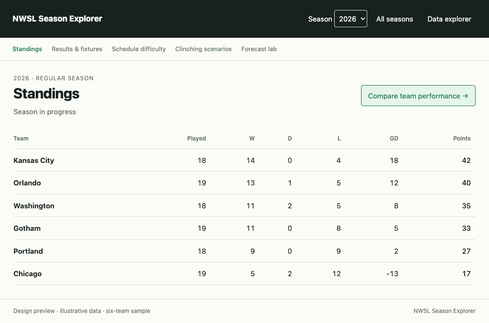
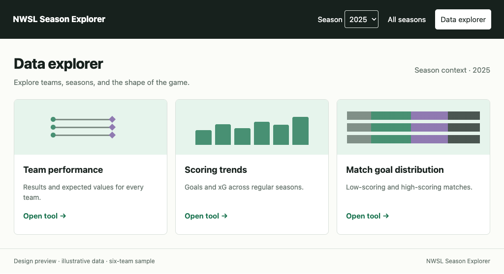
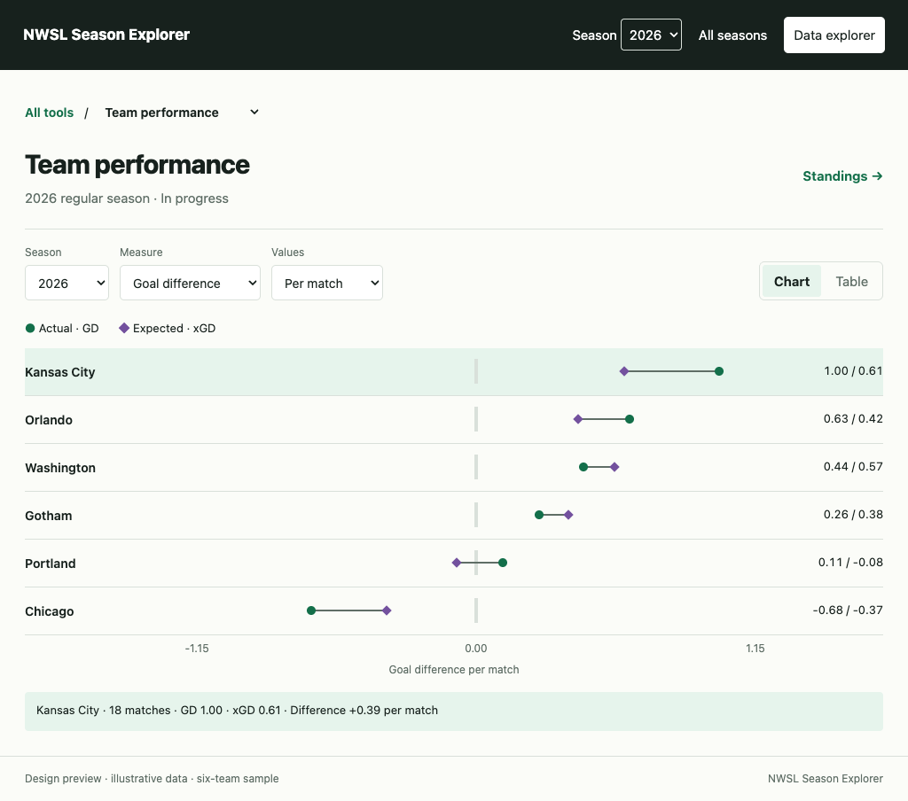

# Data explorer: design and plan for a shippable release

Status: revised proposal for review, September 8, 2026. This replaces the
History-centered proposal previously in this file. Together with
[next steps](next-steps.md), it supersedes the proposed product structure and
sequencing in [IDEAS.md](../IDEAS.md) and [H01–H05](README.md) once accepted.
These are design documents, not delivered behavior or implementation authorization.
The directory is retained to avoid moving the review documents; it does not
imply a product name or URL structure.

## What we are building

**Data explorer** is a discoverable collection of ways to explore NWSL data,
including this season, individual past seasons, and comparisons across seasons.
History is a possible scope, not the product's identity. The existing Standings,
Results & fixtures, Schedule difficulty, Clinching scenarios, and Forecast lab
remain dedicated experiences. Data explorer sits alongside them and shares
season context where that is useful.

The first release should prove two things: the existing scoring work is worth
using, and the same place supports a useful current-season team comparison.
It should not require building the owner's entire list of example analyses.
The durable investment is a home for new exploration tools and a small set of
reusable interaction patterns.

## Navigation: the actual entrances

Introduce a consistent two-level header across the application. Put the product
name and **Season [2026 ▾] · All seasons · Data explorer** in the shared header.
On season pages, keep the current capability-aware page navigation immediately
below it. It retains the existing labels and destinations. Data explorer is a
product destination, not another label hidden among season calculations.

```text
NWSL Season Explorer     Season [2026 ▾]   All seasons   Data explorer
────────────────────────────────────────────────────────────────────
Standings  Results & fixtures  Schedule difficulty  Clinching scenarios  Forecast lab

2026 Regular season
Standings                           Compare team performance →
[existing standings experience]
```

| Starting point | Visible action | Destination and behavior |
| --- | --- | --- |
| Any existing page, including Forecast lab | Data explorer in the shared header | Tool catalog at `/explore?season=2026`, carrying the explicit regular-season context when applicable |
| Standings | Compare team performance beside the heading/table controls | `/explore/team-performance?season=2026`; all teams in the selected season, actual results and expected values |
| Any page | All seasons in the shared header | `/seasons`; a normal, visible destination with or without JavaScript |
| Season selector | Browse all seasons as an explicit action | Same catalog, not a no-script-only link |
| Data explorer tool for one season | Standings and Results links beside the scope | Existing factual pages for that season |
| Data explorer catalog or tool | All tools / tool switcher | Other available tools, without needing to return to a different part of the application |

“2026” above is illustrative: use the configured current season or the explicit
season in the URL, not a hardcoded year or hidden browser storage. On a tool
spanning seasons, replace the single-season header context with **Current season**
as a link back to the configured season; show the range within the tool.
Do not leave a header year implying that a league-wide chart is filtered to it.
Entering from an unsupported cup stage opens the catalog with that context
acknowledged; regular-season tools explicitly switch scope when opened.

On mobile, keep **All seasons** and **Data explorer** as visible labeled links
beneath the brand/season row. The existing page navigation can wrap or use its
own accessible menu, but the new entrances must not disappear into an unlabeled
icon. The change is to the shared header and all page families, not just a new
link on `/seasons`. Relevant seams are `templates/partials.html`, the page view
models, `seasonNavigationForPresentation`, and forecast/error-page rendering.

`/seasons` remains a season-and-stage catalog, not a subsection of History.
Retain clear Standings, Results, and supported stage links; simplify operational
copy. Do not redesign its entire catalog before making it visible and connected.

## The visual model

An interactive review accompanies this revision in the task. It starts on a
representative Standings page so the new entrances can be evaluated in context.
The numbers are synthetic and the season page is a navigation sketch, not a
proposal to replace the existing standings implementation.

The captured examples below make the proposal reviewable outside the task.
The interactive sketch exercises Standings, All seasons, the tool catalog,
current-season comparison controls, table sorting, and league tools. Other
dedicated season navigation labels show placement only. Production URL
restoration, complete season/stage coverage, and final accessibility behavior
remain implementation requirements, not claims about this sketch.

**Entrance from Standings:** persistent product links plus a contextual action.



**Discovering tools:** current-season and cross-season analyses in one catalog.



**Using a tool:** scope, measure, and presentation controls above one main view.



The [390px mobile composition](design-preview/team-performance-mobile.png)
shows the same entrances and controls reflowed for a phone. Browser checks
covered 1024px, 736px, 390px, and 360px in light and dark appearance, including
navigation, local control changes, team-table sorting, value inspection, and
page overflow. These are synthetic design checks, not production data tests.

The following wireframes summarize the structure:

```text
DATA EXPLORER — tool catalog
[shared header, with Data explorer active]

Data explorer                         Season context [2026 ▾]

Team performance          Scoring trends            Match goal distribution
[small paired-dot preview] [small trend preview]     [small stacked-bar preview]
Results and expected      Goals and xG across       How often matches finish
values for every team.    regular seasons.          with 0, 1, 2, 3, or 4+ goals.
[Open tool →]             [Open tool →]              [Open tool →]
```

```text
DATA EXPLORER — inside a tool
[shared header]

All tools / [Team performance ▾]
Team performance                      Standings · Results

Season [2026 ▾]   Measure [Goal difference ▾]   Values [Per match ▾]
                                                [Chart | Table]
Actual results ●    Expected from xG ◇

Team A       ─────────◇────────●                       +0.65 / +0.32
Team B       ───────●────◇──────                       +0.28 / +0.46
Team C       ───●──◇────────────                       −0.14 / −0.03
                  Goal difference per match
```

The **tool catalog** is the place to discover capabilities. Cards have small
visual previews and one concrete description, not question-and-answer essays.
Inside a tool, a labeled switcher lists the other available tools. Chart/Table
are deliberate presentations of the same analysis and population, visible in
the toolbar; they are not buried disclosures. A tool need not offer a table
when it adds no useful exploration, as with distribution counts.

With three tools, no search or category navigation is needed. Growth behavior
is specified in [next steps](next-steps.md). There are no empty future tools,
mandatory subject hierarchy, or universal array of scope/group/view selectors.

## First-release tools

### Team performance: make this season a first-class use case

Default to the current regular season on direct entry and preserve a selected
regular season on contextual entry. Show every team with recorded results,
including an active season with uneven matches played. A completed-season-only
gate would defeat the purpose of this tool.

Use horizontal paired dots for actual and expected values, with the team name
and a shared numeric axis. Default to **Goal difference per match** versus
**Expected goal difference per match**. Offer a small measure choice:

- **Goals scored:** goals for versus xG for.
- **Goal difference:** GD versus xGD.
- **Points:** earned points versus ASA expected points, only where those inputs
  are supported. xG coverage and expected-points coverage are independent.

Offer **Per match / Totals**, with Per match the default to handle unequal games
played. The table shows Team, Matches, Actual, Expected, and Difference, with
headings expanded to the selected measure and unit. Both chart and table can
order by actual, expected, or difference. Use numeric sorting before rounding,
visible sort direction, and a deterministic order for equal values. Call this
an analysis ordering, not an official standing.

Keep actual results visible when expected values are missing; use a clear
unavailable value, never a partial aggregate or zero. The actual/expected pair
must use the same complete set of selected matches. No 20-match league-scoring
threshold applies to individual current-season teams; show matches played and
“Season in progress,” without treating early-season rates as historical records.
Teams with no completed matches remain identifiable with unavailable rates.

This is a bounded new calculation over cached fixtures. It does not need
historical winner metadata, cross-season club identity, percentile profiles,
trajectories, or forecast changes. Raw goals compared with xG must work even if
points comparisons cannot yet be offered for the selected population.

### Scoring trends: rehabilitate the existing work

Present goals and xG per match across regular seasons, using a strong, readable
line-and-dot composition and a **Goals / xG / Both** choice. Goals is the default.
Use direct value labels where they fit, with per-year inspection showing both
series together. Keep shared axes in Both, legible ticks, honest calendar
spacing, and breaks at missing years. Remove the “No regular season” annotation
and prose repeating the axis range. Do not replace missing values with zero.

Show an active year's sample near that observation. At 390px, adapt label
density and nearest-year interaction instead of forcing a 600px chart to scroll.
Do not center the view on a preselected year or append a season-detail panel.

Provide **Chart / Table** in the toolbar. Table columns are Season, Matches,
Goals/match, xG/match, and Goals − xG/match. Make numeric columns sortable, with
unavailable values last in either direction. Use restrained in-cell value
marks and aligned numerals. Exclude inventory, readiness, xPoints coverage, and
internal exclusion columns. A contained horizontal scroll is acceptable for
an exact-value table when its columns cannot fit; it should not dictate chart
layout.

### Match goal distribution: a peer tool

Promote distribution to its own catalog entry, equally discoverable with
Scoring trends. Each season is a horizontal 100% stacked bar with the bins
0, 1, 2, 3, and 4+ total goals. Show percentages on wide segments and inspect
individual segments for season, bin, percentage, and count/denominator.

A labeled bin control highlights the same bin across seasons and shows its
percentages in an aligned position. This helps compare middle segments without
pretending they share a baseline. It also provides touch and keyboard access
to tiny or zero-width bins. Do not widen the quantitative segments to make
hit targets, renormalize after highlighting, or use one long title tooltip for
an entire bar. Remove the separate distribution-counts table as product content.

## Inspection is temporary, not another feature

There is no pinned-season concept in the revised design. Hover, focus, or tap
shows the exact value for the observation being inspected. A tap can hold that
readout open long enough to read it; another tap or a close action replaces or
dismisses it. That is a touch equivalent of hovering, not a saved selection.
It does not filter the chart, change the URL, survive tool switches, open a
profile, or navigate. No default highlight needs to follow the user around.

Reserve a compact readout area on mobile so inspection does not jump the page
or cover the chart. Values, units, team/season identity, and match count are
sufficient. Keyboard users can traverse marks and read the same information;
focus remains visible and values have accessible labels. Explicit links to
Standings or Results live beside scope controls, separate from chart marks.
A future compare-two-teams interaction may have actual selection state, but
only when its analytical purpose and visual behavior are designed.

## Shared appearance and interaction

Use the site's paper, dark green, and numeric typography consistently, with
one contrasting expected-value series and shape/text distinctions beyond color.
Give charts space, confident marks, and restrained grids. Make actual
quantitative differences the visual interest. Avoid invented curve smoothing,
decorative area fills on truncated axes, and cards of disconnected summary facts.

Use consistent separation between navigation, scope controls, main visual, and
any relevant note. Replace the old stacked layout rather than correcting only
the missing margin below its chart. At mobile widths, reflow controls and labels
without shrinking essential text or hiding the route to other tools.

Optimize the real JavaScript-enabled experience: inspection, switching view,
sorting, and changing a supported local control update in place. URLs encode
meaningful tool inputs and table ordering; reload and Back/Forward restore
that state. Preserve keyboard, screen-reader, and touch access as requirements.
Basic server rendering is useful resilience, but elaborate no-JavaScript
interactions must not determine the design or consume the release's polish
budget. Accessibility is broader than disabling JavaScript.

## Keep only consequential data context

Remove “Inventory verified/unverified,” “Data completeness and context,” and
“About this data” from the exploration surface. Retain internal eligibility
checks and footer attribution. Historical unknown inventory is not proof of
missing results, and also not proof of completeness: say “Recorded regular-
season results since 2016” for league comparisons without making final-record
claims. Known-incomplete or malformed historical results remain excluded.

Show short explanations only when they affect the requested values: “Expected
goals unavailable: 2 matches missing xG,” or an in-progress sample. Full xG on
all recorded scored matches does not certify a season's fixture inventory. Keep
xG and xPoints completeness independent. Existing league-scoring eligibility,
including its 20-match threshold, can remain for the two league tools; it is
not a universal rule for Data explorer. Keep methods in the active technical
guide rather than a public diagnostic ledger.

## URLs and migration

Canonical destinations become `/explore` and `/explore/<tool-id>`, for example
`/explore/team-performance?season=2026&metric=goal-difference&view=table`.
Tool IDs are stable and independent of display labels. Each tool owns its
supported parameters; the shared header is not a global filter applied blindly
to every tool. Range-based tools show their actual range and can omit the
catalog's single-season context when opening, visibly changing scope.

Keep `/seasons` and existing dedicated page URLs. Redirect `/history` and
`/history/scoring` to the catalog or the corresponding scoring tool, preserving
compatible metric state. The old `season` parameter selected incidental detail;
it should not become a new filter or pin. Drop it explicitly during migration.
Publish no new History links. All generated links and redirects must continue
to work under the production proxy prefix.

## Implementation and release sequence

| Step | Concrete output | Acceptance |
| --- | --- | --- |
| 1. Review the experience | Interactive navigation sketch plus desktop/mobile tool compositions | Enter from Standings, find All seasons and Data explorer, open current-season Team performance, switch Chart/Table, and find a league tool without explanation |
| 2. Establish the shared shell | Header across existing page families, visible season catalog, tool catalog/switcher, routing and state helpers | No changes to the purpose or capability gating of the five dedicated experiences; the new destinations are navigable from each |
| 3. Deliver the three small tools | Current-season Team performance plus improved Scoring trends and Match goal distribution | Exact values work by pointer, touch, and keyboard; tables are intentional; no pinned detail sections or audit jargon |
| 4. Verify extension and polish | One throwaway tool entry using synthetic data, integrated browser checks, reconciled guide and packets | New tool discovery requires no header/router-template surgery; remove the throwaway entry before shipping |

The three-tool first release is a recommendation to validate both present-
season and cross-season exploration. It is a modest expansion beyond the
existing scoring repair, not a commitment to every metric or future idea.
If splitting implementation, the shared navigation can land first; do not
label the broader product complete while current-season team exploration is
still an unsupported promise.

Test full, partial, empty, zero-match, active/uneven, overlapping, and single-
season cases. Review real desktop and 390px browser output, table ordering,
mobile overflow, focus, screen-reader value access, tool switching, and URL
restoration. Verify all five existing page families and `/seasons` visibly link
to the new destination. The prototype illustrates interaction and layout only;
production calculations, navigation, and availability need their own checks.

Preserve the coherent SQLite snapshot and pure calculation boundaries. Pages
must not contact ASA or initiate backfills. After final Go edits, follow root
and app `AGENTS.md`: formatting, lint, vet, full tests, applicable race suite,
and vulnerability scanning when reachable. Use `NWSL_CONFIG_FILE=/dev/null`
for isolated previews. Update the active guide to delivered behavior and
reconcile old packet contracts before implementing them. This planning change
itself makes no Go or production UI changes.
