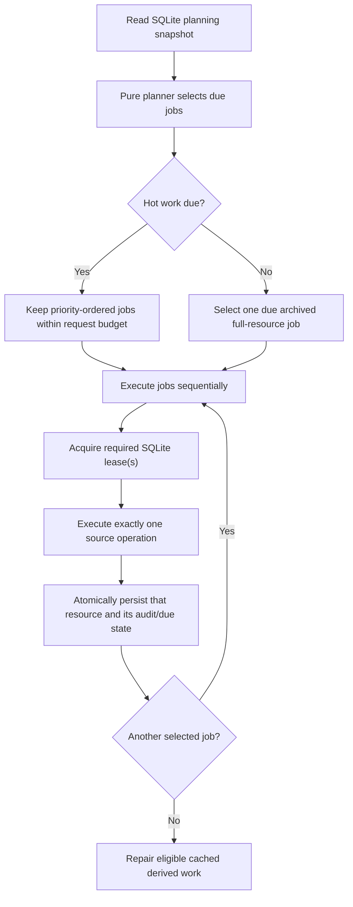

# How synchronization works

Ordinary web requests read the local SQLite cache only. ASA requests are made
by the background scheduler or an explicit `cmd/sync` maintenance command.
The scheduler does not run the former season-wide concurrent `Service.Run`
flow. Its immediate startup check also bootstraps missing public source-backed
catalog scopes, while keeping current-season work ahead of that low-priority
archive loading.

The [ASA loading packet index](asa-loading/README.md) is the implementation
plan and change history. This guide summarizes the delivered operational model.

## Source data and derived data

- **Source data** is upstream-owned: the team catalog, game inventory and
  results, and game xG. Each source request has one owning cache mutation and
  its own audit and cadence state.
- **Derived data** is computed from cached fixtures: qualification and
  clinching scenarios. Recalculation reads the cache and does not contact ASA.
- **Forecast inputs** include fixtures and xG from the current regular season
  and the two preceding regular seasons. Missing public source-backed catalog
  scopes are loaded by the startup scheduler; page reads still never make ASA
  requests to fill them.

## Historical regular-season cache reads

`cache.DB.HistoricalRegularSeasons` reads every public, source-backed,
fixture-capable Regular Season catalog entry from one read-only SQLite snapshot.
It includes unloaded catalog years with nil readiness and empty fixture data, so
absence remains visible to archive callers. This is cache-only behavior: it
does not create source scopes, update audit state, or introduce any refresh
work.

## Scheduler: pure planning, then sequential execution

On startup and each `NWSL_SYNC_CHECK_INTERVAL` tick, the scheduler reads one
consistent planning snapshot from SQLite. `scheduler.Plan` is pure: it uses the
snapshot, configuration, and a supplied clock to return an ordered batch of
due jobs. Planning does not make HTTP requests, acquire leases, or advance due
times.

Hot work takes precedence over archived correction work. Within the hot tier,
the planner orders jobs as follows:

1. authoritative games inventory when a scope is missing or not yet published;
2. one batched targeted-games request for due result checks in a scope;
3. authoritative full-stage xG when a published inventory has not yet had one;
4. one batched targeted-xG request for due completed games in a scope; and
5. weekly authoritative inventory audits for active or upcoming scopes.

Missing public source-backed catalog scopes are included in the bootstrap
inventory tier only until their first fixture inventory is observed. The
configured current primary stage comes first, followed by current secondary
stages in catalog order, historical primary stages newest first, then
historical secondary stages in catalog order. Historical scopes use no format
assumptions, so the planner sends no expected team or fixture counts for them.
After inventory is available, initial xG loading proceeds independently; later
corrections use the archived sweep. A material targeted result in an incomplete
active bracket also makes its next full-games discovery due immediately; the
following scheduler tick performs that one collection request.

The default source-request budget is three operations per tick. Jobs beyond the
budget stay due because planning does not mutate their cadence state. Selected
operations execute sequentially; there is no concurrent teams/games/xG fetch
or single-target reconciliation path.

At server startup only, the scheduler drains an otherwise due public catalog
bootstrap in additional normal-budget batches separated by five seconds. That
includes missing fixture inventory and each scope's first full xG load; it does
not accelerate routine result checks, correction work, or derived calculations.
The drain stops on a source failure, lease deferral, cancellation, or when the
next normally selected batch has no catalog bootstrap work. Normal five-minute
cadence then resumes.

### Independent result and xG cadence

Games and xG are independent resources with independent full and per-game
check state. A targeted operation sends all selected IDs for one resource and
scope in one request; an omitted ID is a checked observation, not a deletion.

| Work | Default cadence and window |
| --- | --- |
| Unsettled result after kickoff plus completion grace | Every scheduler interval (normally 5 minutes) while due. |
| Terminal result correction | Every 6 hours for 3 days after kickoff. |
| Missing xG for a completed game | Every 5 minutes for 5 days after kickoff. |
| Available xG correction | Every 6 hours for 5 days after kickoff. |
| Active/upcoming full inventory audit | Every 7 days. |

Invalid or missing kickoffs are not turned into immediate targeted polling;
authoritative inventory reconciliation remains the safety net. Material game
changes in the configured current scope can trigger cache-only qualification
and scenario recalculation. Material fixture or xG changes in the current or
previous two regular seasons can warm forecasts. No-op, omitted, stale, or
failed source observations do not create derived work.

## Split source operations

`syncer.Service.Execute` performs exactly one source operation:

| Resource | Full mode | Targeted mode |
| --- | --- | --- |
| Teams | Fetches `/nwsl/teams` and upserts the independent catalog. | Not used. |
| Games | Fetches the authoritative season/stage collection and replaces that scope's inventory. | Fetches requested game IDs and updates only those checked games. |
| Game xG | Fetches authoritative stage xG after fixture inventory exists. | Fetches xG for requested game IDs and updates only those checked values. |

The operation validates and maps the one ASA response before invoking its
resource-specific cache API. Full game inventory replacement retains a prior
complete inventory when an incoming known inventory is incomplete or uneven.
Targeted operations do not delete unrequested records. If a game write finds
unknown teams, the service refreshes the catalog once and retries the same
validated write without refetching games.

Each operation persists its own success or failure audit and due state. A
failed request does not advance a successful observation or replace a durable
resource state. HTTP retries remain bounded by the per-operation request
deadline.

ASA occasionally uses paired `0-0` penalty scores with its penalties flag
false or absent as a no-shootout sentinel. The source mapper preserves raw JSON
but stores those two normalized scores as absent; it never infers a shootout or
winner. Lone, negative, and nonzero scores without `penalties=true` remain
rejected before a cache write.

## Leases and archived corrections

Before executing a hot job, the scheduler acquires a SQLite lease for that
season/stage scope. This serializes source writes across server and maintenance
processes. If the lease is unavailable, the job is deferred without an ASA
request.

Completed, available scopes become eligible for cold correction sweeps only
after a successful full games observation. When no hot job is due, the planner
selects at most one due cold job: full games first, then full xG on a later
planner pass. Cold work has a 30-day default interval, staggered per scope.
It acquires a global cold-sweep lease followed by the scope lease, releasing in
reverse order. A material historical correction is reported so model-evaluation
evidence can be regenerated.

## Explicit sync and maintenance commands

The normal `cmd/sync` command is a forced selected-scope compatibility
sequence, not the scheduler's hot path. It conditionally refreshes teams,
then runs full games and full xG sequentially under the scope lease. It can
then run derived calculations for a scope with configured competition rules.

The maintenance modes are mutually exclusive:

- `-recalculate` runs qualification and clinching calculations from cached
  fixtures without contacting ASA.
- `-backfill-historical` force-refreshes supported historical regular seasons
  sequentially through the compatibility sequence. It remains useful for an
  operator-requested complete refresh, but is no longer required to populate
  missing historical catalog scopes because startup does that incrementally.
- `-backfill-catalog` refreshes the teams catalog once, then every public
  source-backed stage sequentially in the same bootstrap priority order. It
  keeps non-configured stages source-only.
- `-sweep-due-archived` repeatedly takes fresh snapshots and runs due cold
  work until complete, deferred by hot work or a lease, or failed.
- `-prune-history-before` removes superseded operational history before the
  supplied RFC 3339 time.

`-force` asks derived calculations to run after the normal selected-scope
source sequence; it never bypasses source validation.

## Operational defaults

`NWSL_SYNC_TIMEOUT` defaults to `2m` and bounds one scheduler source operation
or one explicit selected-scope sync. `NWSL_SYNC_CHECK_INTERVAL` defaults to
`5m`; `NWSL_SYNC_COMPLETION_GRACE` defaults to `2h`. The public configuration
table in [README.md](../README.md#configuration) is authoritative for
environment-variable defaults.

## Implementation map

- Pure job priority, batching, cadence, and cold selection:
  [`internal/scheduler/planner.go`](../internal/scheduler/planner.go)
- Scheduler ticks, budgets, leases, execution, and cache-only recalculation:
  [`internal/scheduler/scheduler.go`](../internal/scheduler/scheduler.go)
- One-resource ASA requests and cache mutations:
  [`internal/syncer/operations.go`](../internal/syncer/operations.go)
- Selected-scope compatibility and derived recalculation:
  [`internal/syncer/syncer.go`](../internal/syncer/syncer.go)
- Explicit command modes:
  [`cmd/sync/main.go`](../cmd/sync/main.go)
