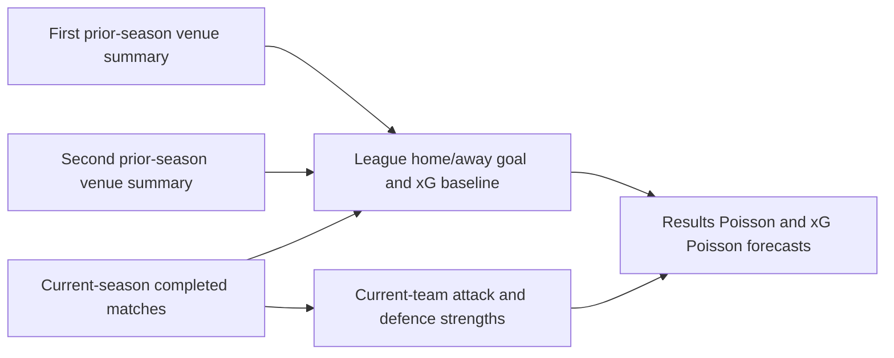
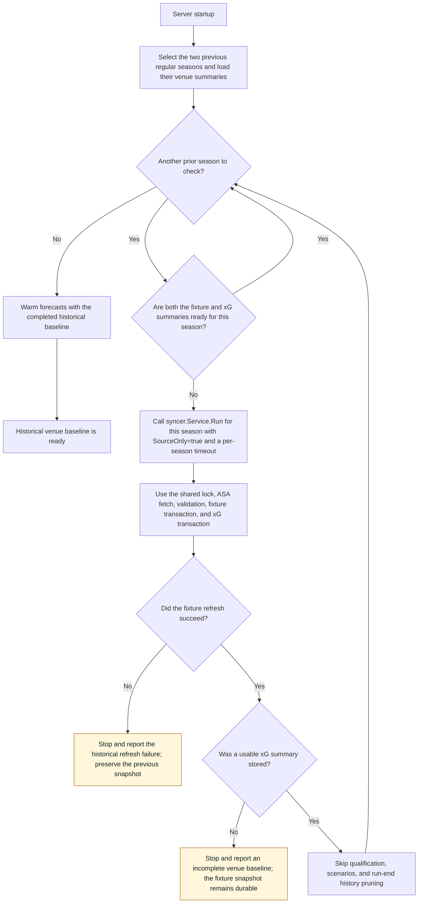
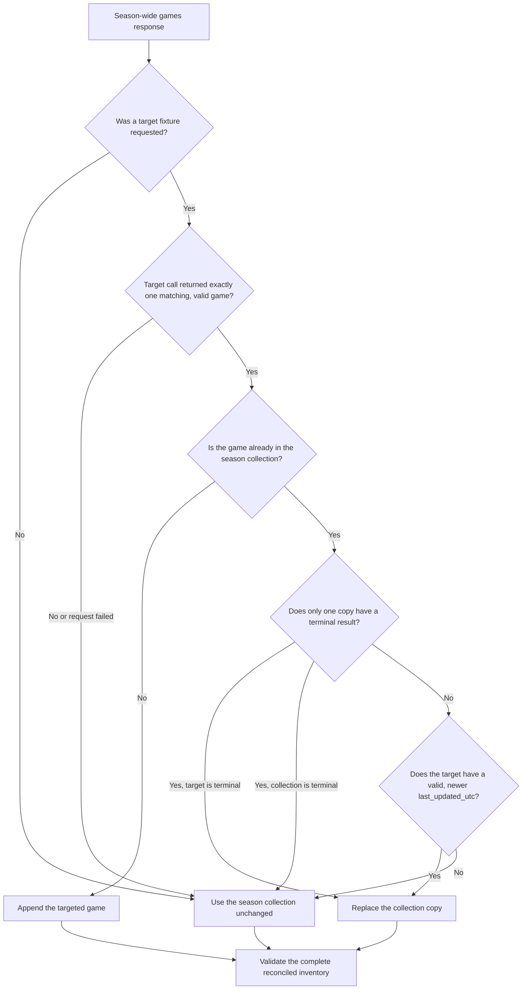

# How synchronization works

This guide describes the current path from a scheduler check or maintenance
command to a durable season snapshot. The central rule is that ordinary web
requests read SQLite only. ASA requests happen in the background scheduler,
the sync command, or a startup refresh that fills a missing historical venue
baseline. The proposed replacement for this season-snapshot model is in the
[ASA data catalog and loading plan](asa-data-catalog-and-loading-plan.md).

## Terms and the historical venue baseline

The implementation refreshes two different kinds of data:

- **ASA data** is owned by the upstream API: teams, fixtures, results, and xG.
  An **ASA data refresh** calls ASA, validates those responses, and writes them
  to SQLite.
- **Derived data** is calculated by this application from a durable fixture
  snapshot: qualification status and clinching scenarios. A derived-data
  refresh does not need another ASA request.

The forecast models also need a stable league-level estimate of home and away
scoring conditions. Their current venue baseline combines the current season
with the two previous regular seasons. Rather than rereading and aggregating
all historical matches whenever a forecast runs, SQLite keeps one compact
venue summary per season containing match counts, home/away goals and points,
and home/away xG.

Historical teams do not contribute to current-team strengths. Their aggregate
results only make the shared league home/away baseline less sensitive to a
small or unusual current-season sample. Because this startup process has a
different trigger and stopping point, it has a separate flow below.

## Current-season and maintenance refresh flow

```mermaid
flowchart TD
    subgraph ENTRY["1. Choose whether to synchronize"]
        START["Server starts, then scheduler ticks"] --> SNAPSHOT["Read the cached refresh snapshot"]
        SNAPSHOT --> ASSESS{"Is an ASA refresh eligible?"}
        ASSESS -->|"No: known match window is current"| RECALC["Repair missing or retryable derived calculations from cache"]
        RECALC --> NO_NETWORK["Finish without an ASA request"]
        ASSESS -->|"Yes"| TARGET{"Reason is an overdue, plausibly complete fixture?"}
        TARGET -->|Yes| TARGET_ID["Pass that fixture ID as TargetFixtureID"]
        TARGET -->|No| NO_TARGET["Run without a targeted fixture"]
        CLI["Maintenance sync command"] --> NO_TARGET
    end

    subgraph LOCKING["2. Serialize the refresh"]
        TARGET_ID --> RUN["Start syncer.Service.Run"]
        NO_TARGET --> RUN
        RUN --> MUTEX["Acquire the process-local run mutex"]
        MUTEX --> LEASE{"Acquire the SQLite season-stage lease?"}
        LEASE -->|No| CONFLICT["Return sync-in-progress"]
        LEASE -->|Yes| FETCH["Fetch independent ASA resources concurrently"]
    end

    subgraph FETCHING["3. Fetch ASA data"]
        FETCH --> TEAMS["Required: all NWSL teams"]
        FETCH --> SEASON["Required: season and stage games for all supported statuses"]
        FETCH --> XG["Best effort: season and stage game xG"]
        FETCH -.->|"When TargetFixtureID is set"| ONE_GAME["Best effort: the same games endpoint filtered by game_id"]
        TEAMS --> REQUIRED{"Required fetches succeeded?"}
        SEASON --> REQUIRED
        REQUIRED -->|No| RECORD_FAILURE["Record failed sync; keep the previous season snapshot"]
        REQUIRED -->|Yes| RECONCILE["Reconcile the targeted response with the season collection"]
        ONE_GAME -.-> RECONCILE
    end

    subgraph VALIDATION["4. Validate before writing"]
        RECONCILE --> VALIDATE["Validate IDs, season, teams, kickoff, status, scores, duplicates, and configured inventory"]
        VALIDATE --> RESULT{"Validation result"}
        RESULT -->|Valid| MAP["Map ASA values to cache records"]
        RESULT -->|"Incomplete configured inventory"| RETRY["Wait 250 ms, refetch the season games once, and reconcile the same target again"]
        RETRY --> VALIDATE_AGAIN{"Retry is valid?"}
        VALIDATE_AGAIN -->|Yes| MAP
        VALIDATE_AGAIN -->|No| RECORD_FAILURE
        RESULT -->|"Any other invalid data"| RECORD_FAILURE
        MAP --> REPLACE{"Atomically replace the cached season?"}
        REPLACE -->|No| RECORD_FAILURE
        REPLACE -->|Yes| DURABLE["Commit teams, fixtures, snapshot ID, and successful sync audit row"]
    end

    subgraph AFTER["5. Refresh dependent data"]
        DURABLE --> XG_REFRESH["Validate and store the concurrently fetched xG"]
        XG -.-> XG_REFRESH
        XG_REFRESH -->|"Unavailable or invalid"| XG_WARNING["Record an xG warning; fixture sync remains successful"]
        XG_REFRESH -->|Stored| QUAL["Refresh qualification within its own budget"]
        XG_WARNING --> QUAL
        QUAL --> QUAL_OK{"Qualification succeeded?"}
        QUAL_OK -->|Yes| SCENARIOS["Refresh clinching scenarios within their own budget"]
        QUAL_OK -->|No| PRUNE["Skip scenarios and retain a partial-failure warning"]
        SCENARIOS --> PRUNE["Prune old audit history when configured"]
        PRUNE --> SERVICE_DONE["Return the sync result"]
        SERVICE_DONE -.->|"Server scheduler and forecast inputs changed"| WARM["Warm process-local baseline forecasts"]
        WARM --> COMPLETE["Finish"]
        SERVICE_DONE --> COMPLETE
    end

    classDef required fill:#e6f4ec,stroke:#136f4a,color:#17211d;
    classDef optional fill:#f1ecfb,stroke:#5b3f96,color:#17211d;
    classDef failure fill:#fff6dc,stroke:#9b6500,color:#17211d;
    class TEAMS,SEASON,VALIDATE,MAP,REPLACE,DURABLE required;
    class XG,ONE_GAME,XG_REFRESH,XG_WARNING,QUAL,SCENARIOS,WARM optional;
    class RECORD_FAILURE,CONFLICT failure;
```

The scheduler considers a refresh eligible when the cache has no successful
snapshot, has no fixtures, has an incomplete configured fixture inventory, has
an unsupported status or invalid kickoff, contains an overdue fixture that is
not settled, or needs another attempt at missing xG. Only the overdue-fixture
case supplies `TargetFixtureID`; the other cases still perform the normal
season-wide fetch without an individual-game request.

The production server and maintenance command always fetch and store xG: their
concrete `asa.Client` and `cache.DB` implementations provide the required xG
methods. Internally, `syncer.Service` models those methods as optional Go
interfaces so fixture-only test doubles or alternate callers can reuse the core
sync path. That type assertion is an implementation extension point, not a
runtime configuration or an ASA availability decision, so it is omitted from
the production flow above.

## Historical venue-baseline refresh flow

At server startup, `EnsureVenueHistory` checks the two previous regular seasons
one at a time. A ready summary causes no ASA request. A missing fixture or xG
summary runs the shared ASA refresh core from the diagram above with a separate
timeout for that season.

Here, **source** means the ASA-owned inputs: teams, fixtures, results, and xG.
The internal `SourceOnly` option says to persist only those inputs and the venue
summary derived directly from them, then return before application-derived
qualification and scenario work. That behavior exists because forecasts need
the prior seasons' aggregate home/away baseline, not their clinching state.
Once both summaries are ready, the server warms the forecast cache again so
new results use the historical baseline.

## Targeted fixture reconciliation

The targeted request is not a separate result API. It calls `/nwsl/games` with
the normal season and stage filters plus `game_id`. It supplements the required
season collection because ASA may publish one completed game before that result
appears in the broader collection.

A terminal game is either `Abandoned`, or `FullTime` with both scores. An empty,
malformed, mismatched, or failed targeted response never prevents a normal sync
from using a valid season collection. Conversely, the targeted copy cannot
replace a terminal collection copy with stale pre-match data.

## ASA request set

| Request | When made | Failure effect |
| --- | --- | --- |
| `/nwsl/teams` | Every ASA data refresh | Fails the fixture sync before any season data is replaced. |
| `/nwsl/games?season_name=...&stage_name=...&status=...` | Every ASA data refresh | Fails the fixture sync. An incomplete configured inventory gets one extra collection fetch. |
| `/nwsl/games?game_id=...&season_name=...&stage_name=...` | Only when the scheduler selects an overdue fixture | Best effort; failure falls back to the season collection. |
| `/nwsl/games/xgoals?season_name=...&stage_name=...` | Every production ASA data refresh | Best effort after the fixture commit; failure is recorded as a partial warning. A historical venue-baseline refresh additionally reports that its baseline could not be completed. |

Each HTTP request has a bounded retry policy. Production uses two retry delays,
250 milliseconds and one second, for transient transport failures and retryable
HTTP statuses. A longer supported `Retry-After` header takes precedence. The
sync-wide context deadline still bounds all attempts.

## Safety and completion semantics

- The process mutex and SQLite lease prevent overlapping writers in one process
  and across the server and maintenance command.
- Required ASA data is fully fetched, reconciled, and validated in memory
  before `ReplaceSeason` starts its transaction.
- A failed required fetch, invalid response, or database replacement records a
  failed run and preserves the previous usable snapshot.
- The configured schedule check verifies both total fixture count and each
  team's number of appearances. For the 2026 regular season that means 240
  fixtures, 16 teams, and 30 appearances per team.
- xG storage, qualification, scenarios, history pruning, and forecast warming
  happen after the fixture snapshot is durable. Their failures do not roll back
  the season snapshot; they are reported separately from the core sync outcome.
- `-force` does not bypass ASA response validation. It forces completed
  qualification and scenario batches to be recalculated after the normal ASA
  data refresh.
- `-recalculate` is a separate path: it reads the last successful fixture
  snapshot and reruns derived calculations without contacting ASA or replacing
  ASA data.

## Implementation map

- Scheduler eligibility and target selection:
  [`internal/scheduler/scheduler.go`](../internal/scheduler/scheduler.go)
- ASA request orchestration, validation, reconciliation, and post-sync work:
  [`internal/syncer/syncer.go`](../internal/syncer/syncer.go)
- Historical venue-baseline readiness and refresh selection:
  [`internal/syncer/venue_history.go`](../internal/syncer/venue_history.go)
- ASA filters, HTTP retries, response bounds, and decoding:
  [`internal/asa/client.go`](../internal/asa/client.go)
- Atomic SQLite replacement and sync audit records:
  [`internal/cache/cache.go`](../internal/cache/cache.go)
- Server scheduler and forecast-warming integration:
  [`cmd/server/main.go`](../cmd/server/main.go)
- Maintenance sync and recalculation entry point:
  [`cmd/sync/main.go`](../cmd/sync/main.go)

The design history and operational policy remain in
[`phases/03-sqlite-cache.md`](phases/03-sqlite-cache.md) and
[`phases/08-operations.md`](phases/08-operations.md). This guide documents the
current implementation rather than the sequence in which it was built.
